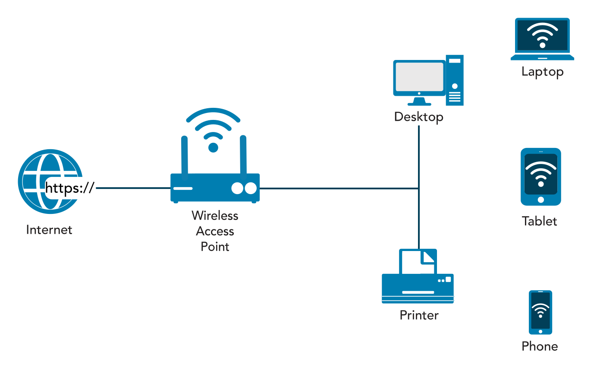
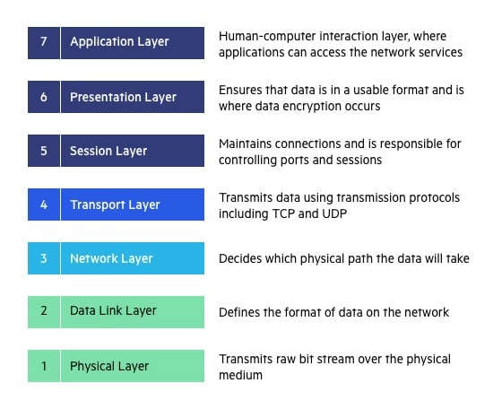
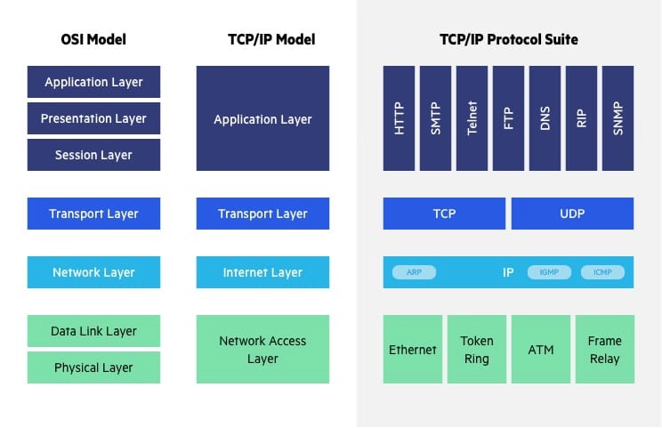
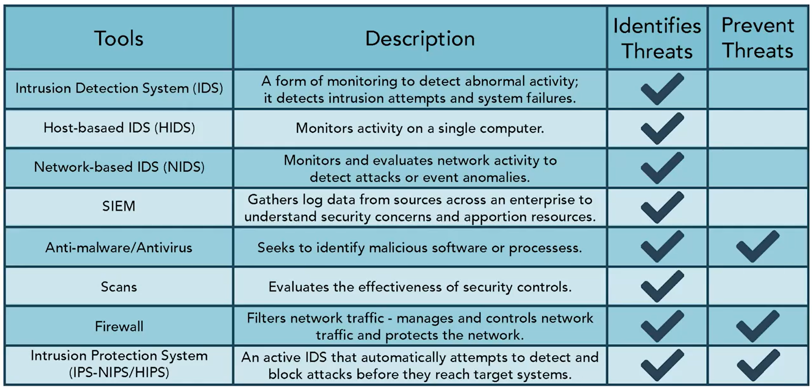
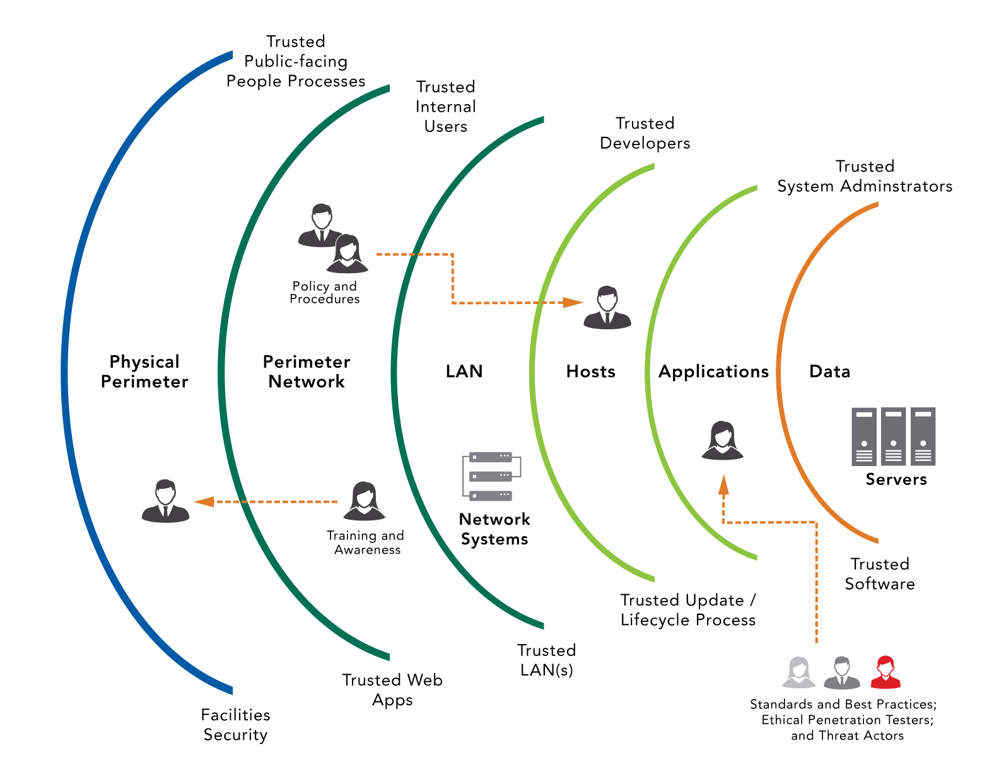
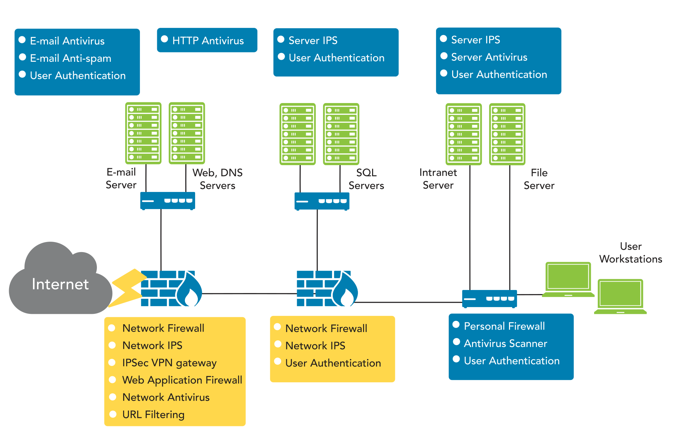

## Chapter 4: Network Security

* A network is simply two or more computers linked together to share data, information or resources.

### Module 1: Understand Conputer Networking
#### Domain D4.1.1, D4.1.2
#### Module Objective
   - [ ] L4.1.1 Recognize common networking terms and models.
   - [ ] L4.1.2 Identify common protocols and ports and their secure counterparts when presented with a network diagram.

* Types of Networks -
  * **Local area network** (LAN) is a network typically spanning a single floor or building and is commonly a limited geographical area.
  * **Wide area network** (WAN) is the term usually assigned to the long-distance connections between geographically remote networks.

* Network Devices -
  * Hubs -
    * are used to **connect multiple devices** in a network.
    * are **wired** devices and are not as smart as switches or routers.
  * Switch (Intelligent Hub) -
    * are wired devices that know the addresses of the devices connected to them and
    * route traffic to that port/device rather than retransmitting to all devices.
  * Routers -
    * are used to control traffic flow on networks and
    * are often used to connect similar networks and control traffic flow between them.
    * can be wired or wireless and can connect multiple switches.
    * are smarter than hubs and switches, routers **determine the most efficient “route”** for the traffic to flow across the network.
  * Firewalls -
    * are essential tools in **managing and controlling** network traffic and protecting the network.
    * is a network device used to filter traffic and is typically deployed between a private network and the internet, but it can also be deployed between departments (segmented networks) within an organization (overall network).
    * filter traffic based on a defined set of rules, also called filters or **access control lists**.
  * Server -
    * is a computer that provides information to other computers on a network.
    * some common servers are web servers, email servers, print servers, database servers and file servers.
    * All of these are, by design, networked and accessed in some way by a client computer.
  * Endpoints -
    * are the ends of a network communication link.
    * One end is often at a server where a resource resides, and the other end is often a client making a request to use a network resource.

* Ethernet -
  * Ethernet ([IEEE 802.3](https://en.wikipedia.org/wiki/IEEE_802.3)) is a standard that defines wired connections of networked devices.
  * This standard defines the way data is formatted over the wire to ensure disparate devices can communicate over the same cables.

* Device Address -
  * Media Access Control (MAC) Address -
    * Every network device is assigned a Media Access Control (MAC) address. An example is 00-13-02-1F-58-F5.
    * The first 3 bytes (24 bits) of the address denote **the vendor or manufacturer*** of the physical network interface.
    * No two devices can have the same MAC address in the same local network; otherwise an address conflict occurs.
    * is generally assigned in the firmware of the interface.
  * Internet Protocol (IP) Address -
    * Leveraging the MAC address, IP hosts associate it with a **unique logical address**.

* Networking at a glance -
  * **Business Network** - 
  * **Home Network** - 
  * The primary difference between the home network and the business network is that
    * **the router, firewall, and network switch** are often combined into one device supplied by your internet provider and shown here as the wireless access point.

* Networking Models -
  * Computers and networks emerge from the **integration** of *communication devices, storage devices, processing devices, security devices, input devices, output devices, operating systems, software, services, data and people*.
  * The purpose of all communications is to exchange information and ideas between people and organizations so that they can get work done.
    * Those simple goals can be re-expressed in network (and security) terms such as:
      * Provide reliable, managed communications between hosts (and users)
      * Isolate functions in layers
      * Use packets as the basis of communication
      * Standardize routing, addressing and control
      * Allow layers beyond internetworking to add functionality
      * Be vendor-agnostic, scalable and resilient
  * In the most basic form, a network model has **at least two** layers -
    * Upper Layer (Application) -
      * is responsible for managing the integrity of a connection and
      * controlling the session as well as establishing, maintaining and terminating communication sessions between two computers.
      * is also responsible for transforming data received from the Application Layer into a format that any system can understand.
      * finally, it allows applications to communicate and determines whether a remote communication partner is available and accessible.
    * Lower Layer (Data Transport) -
      * is often referred to as the media or transport layer.
      * is responsible for receiving bits from the physical connection medium and converting them into a frame. Frames are grouped into standardized sizes.
      * Route data is added to the frames of data to create packets. In other words, a destination address is added to the bucket.

* Open Systems Interconnection (OSI) Model -
  * was developed to establish **a common way to describe the communication structure for interconnected computer systems**.
  * serves as an abstract framework, or theoretical model, for how protocols should function in an ideal world, on ideal hardware.
  * divides networking tasks into ***seven distinct layers*** wherein each layer is responsible for performing specific tasks or operations with the goal of supporting data exchange (in other words, network communication) between two computers.
  * The layers are ordered specifically to indicate how information flows through the various levels of communication. Each layer communicates directly with the layer above and the layer below it.
  * [OSI Model](https://www.cloudflare.com/learning/ddos/glossary/open-systems-interconnection-model-osi/)- 
    * The *Application, Presentation, and Session* Layers (5-7) are commonly referred to simply as data.
    * Encapsulation is the addition of header and possibly a footer (trailer) data by a protocol used at that layer of the OSI model.
    * Encapsulation is particularly important when discussing *Transport, Network and Data Link* layers (2-4), which all generally include some form of header.
    * Encapsulation & Decapsulation [Process](https://www.techtarget.com/searchnetworking/tip/Intro-to-encapsulation-and-decapsulation-in-networking) - 
    * At the *Physical* Layer (1), the data unit is converted into binary, i.e., 01010111, and sent across physical wires such as an ethernet cable.

* Transmission Control Protocol/Internet Protocol (TCP/IP)
  * TCP/IP is a functional model designed to solve specific communication problems, and which is based on specific, standard protocols.
    * *Application* Layer - Defines the protocols for the transport layer.
    * *Transport* Layer -	Permits data to move among devices.
    * *Internet* Layer - Creates/inserts packets.
    * *Network Interface/Access* Layer -	How data moves through the network.
  *  TCP/IP can be found in just about every available operating system, but
     *  it consumes a **significant amount of resources** and
     *  is relatively **easy to hack** into because it was designed for ease of use rather than for security.

* OSI - TCP/IP Protocol Suite -
  * 

* Internet Protocol (IPv4 & IPv6) -
  * IP hosts/devices associate an address with a unique logical address. An IPv4 address is expressed as **four octets** separated by a dot (.), for example, 216.12.146.140.
    * Each octet may have a value **between 0 and 255**. However, 0 is the network itself (not a device on that network), and 255 is generally reserved for broadcast purposes.
    *  Each address is subdivided into two parts: the **network** number and the **host**.
    *  [IP Address Classes](http://www.tcpipguide.com/free/t_IPClassfulAddressingNetworkandHostIdentificationan-3.htm) - 
   *  To ease network administration, networks are typically **divided into subnets**. Because subnets cannot be distinguished with the addressing scheme discussed so far, a separate mechanism, the **subnet mask** (e.g., 255.255.255.0), is used to define the part of the address used for the subnet.
   * With the ever-increasing number of computers and networked devices, it is clear that IPv4 does not provide enough addresses for our needs. To overcome this shortcoming, IPv4 was **sub-divided into public and private** address ranges.
     * Private IP Rages available for any one use are -
       * **10.0.0.0 to 10.255.255.254**
       * **172.16.0.0 to 172.31.255.254**
       * **192.168.0.0 to 192.168.255.254**
     * Loopback Address -
       * The address 127.0.0.1 is used as loopback address and is used to provide a mechanism for self-diagnosis and troubleshooting at the machine level.
       * This mechanism allows a network administrator to treat a local machine as if it were a remote machine and ping the network interface to establish whether it is operational.
     * IPv6 -
       * 128 bits (e.g. **2001:0db8:0000:0000:0000:ffff:0000:0001**) with 8 octets and can accommodate 2128 or  340,282,366,920,938,463,463,374,607,431,768,211,456 hosts.
       * **IPsec** is an optional part of IPv4 networks, but a mandatory component of IPv6 networks. This will help ensure the integrity and confidentiality of IP packets and allow communicating partners to authenticate with each other.
       * **::1** is the local loopback address, used the same as 127.0.0.1 in IPv4.

* Security of the Network -
  * Improperly implemented TCP/IP stacks in various operating systems are vulnerable to various
    * DoS/DDoS attacks,
    * fragment attacks,
    * oversized packet attacks,
    * spoofing attacks, and
    * man-in-the-middle attacks.
  * TCP/IP (as well as most protocols) is also subject to passive attacks via monitoring or sniffing (the act of monitoring traffic patterns to obtain information about a network).

* Port and Protocols -
  * **Physical** ports on routers, switches, servers, computers, etc. to connect the wires (fiber optic cables, Cat5 cables, etc.,) to create a network.
  * **Logical** ports (socket) to determine where the data/traffic goes.
    * **Well-known ports (0–1023)** - SSH, SMTP, DNS, FTP, etc.
    * **Registered ports (1024–49151)** - Often associated with proprietary applications from vendors and developers.
    *  **Dynamic or private ports (49152–65535)** - Whenever a service is requested that is associated with well-known or registered ports, those services will respond with a dynamic port that is used for that session and then released.
   * Secure Ports -
     * Some network protocols transmit information in clear text, meaning it is not encrypted and should not be used.
     * Clear text information is subject to network sniffing. This tactic uses software to inspect packets of data as they travel across the network and extract text such as usernames and passwords.
     * Commonly used insecure ports and secure alternate ports to them -
        | Protocal| Insecure Port| Secure Port | Protocol |
        | :------: | :------: | :------: | :------: |
        | FTP | 21 | 22 | Secure FTP |
        | Telnet | 23 | 22 | Secure SHell |
        | SMTP | 25 | 587 | SMTP with TLS |
        | Time | 37 | 123 | NTP |
        | DNS | 53 | 853 | DNS over TLS |
        | HTTP | 80 | 443 | HTTPS |
        | IAMP | 143 | 993 | IMAP for SSL/TLS |
        | SMB | 445 | 2049 | NFS |
        | LDAP | 389 | 636 | LDAPS |
---

### Module 2: Understand  Network (Cyber) Threats & Attacks
#### Domain D4.1.2, D4.2.2, D4.2.3
#### Module Objective
   - [ ] L4.2.1 Identify types of network (cyber) threats.
   - [ ] L4.2.2 Discuss common tools used to identify and prevent threats.

* Type of Threats -
  * **Spoofing** is an attack with the goal of gaining access to a target system through the use of a falsified identity.
  * **Phishing** is an attack that attempts to misdirect legitimate users to malicious websites through the abuse of URLs or hyperlinks in emails.
  * **Denial-of-service (DoS)** is a network resource consumption attack that has the primary goal of preventing legitimate activity on a victimized system.
  * **Virus** is a self-replicating piece of code that spreads without the consent of a user, but frequently with their assistance (a user has to click on a link or open a file). Computer viruses have two main functions - **propagation** and **destruction**.
  * **Worms** have the same destructive potential as viruses but with added twist of self-propogation with no requirement of human intervention.
  * **Trojan** is a software program that appears benevolent but carries a malicious, behind-the-scenes payload that has the potential to wreak havoc on a system or network.
  * **Man-in-the-middle (MITM)** is an on-path attack, attackers place themselves between two devices, often between a web browser and a web server, to intercept or modify information that is intended for one or both of the endpoints.
  * **Side-channel** attack is a passive, noninvasive attack to observe the operation of a device.
  * **Advanced persistent threat (APT)** refers to threats that demonstrate an unusually high level of technical and operational sophistication spanning months or even years.
  * **Insider threats** are threats that arise from individuals who are trusted by the organization. They are not always willing participants. A trusted user who falls victim to a scam could be *an unwilling* insider threat.
  * **Malware** is a program that is inserted into a system, usually covertly, with the intent of compromising the confidentiality, integrity or availability of the victim’s data, applications or operating system or otherwise annoying or disrupting the victim.
  * **Ransomware** is a malware used for the purpose of facilitating a ransom attack. Ransomware attacks often use cryptography to “lock” the files on an affected computer and require the payment of a ransom fee in return for the “unlock” code.

 * Threat Detection & Prevention Tools -
   * 
   * Intrusion Detection System (IDS) -
     * An intrusion occurs when an attacker is able to **bypass or thwart security mechanisms** and gain access to an organization’s resources.
     * Intrusion detection is a specific form of monitoring that monitors recorded information and real-time events to detect abnormal activity indicating a potential incident or intrusion.
     * An intrusion detection system (IDS) **automates the inspection of logs and real-time system events** to detect intrusion attempts and system failures.
     * An IDS is intended as part of a ==defense-in-depth security== plan. It will work with, and complement, other security mechanisms such as firewalls, but it does not replace them.
     * IDSs can recognize attacks that come from external connections, such as an attack from the internet, and attacks that spread internally, such as a malicious worm. Once they detect a suspicious event, they respond by sending alerts or raising alarms. ==A primary goal of an IDS is to provide a means for a timely and accurate response to intrusions.==
     * Types of IDSs -
       * Host-based IDS (HIDS) -
         * monitors activity on a single computer, including process calls and information recorded in system, application, security and host-based firewall logs.
         * can often examine events in more detail than a NIDS can, and it can pinpoint specific files compromised in an attack and can also track processes employed by the attacker.
         * can ==detect anomalies== on the host system that NIDSs cannot detect but are expesive and hard to mange than NIDSs.
       * Network-based IDS (NIDS) -
         * monitors and evaluates network activity to detect attacks or event anomalies. It cannot monitor the content of encrypted traffic but can monitor other packet details.
         * can monitor a large network by using remote sensors to collect data at key network locations that send data to a central management console. These sensors can monitor traffic at routers, firewalls, network switches that support port mirroring, and other types of network taps.
         * is usually able to detect the initiation of an attack or ongoing attacks, but they can’t always provide information about the success of an attack. They won’t know if an attack affected specific systems, user accounts, files or applications.
     * Security Information and Event Management (SIEM) -
       * Security management involves the use of tools that collect information about the IT environment from many disparate sources to better examine the overall security of the organization and streamline security efforts. These tools are generally known as security information and event management  solutions.
       * The general idea of a SIEM solution is to ==gather log data from various sources== across the enterprise to better ==understand potential security concerns== and apportion resources accordingly.
   * Thret Prevention -
     * There are some basic steps you can take that help reduce the risk of many types of threats -
       * Keep systems and applications up to date. Patch management ensures that systems and applications are kept up to date with relevant patches.
       * Remove or disable unneeded services and protocols. If a system doesn’t need a service or protocol, it should not be running. Attackers cannot exploit a vulnerability in a service or protocol that isn’t running on a system.
       * Use intrusion detection and prevention systems. As discussed, intrusion detection and prevention systems observe activity, attempt to detect threats and provide alerts. They can often block or stop attacks.
       * Use up-to-date anti-malware software.
       * Use firewalls. Firewalls can prevent many different types of threats. Network-based firewalls protect entire networks, and host-based firewalls protect individual systems.
     * **Antivirus** -
       * tries to identify malware based on the signature of known malware or by detecting abnormal activity on a system. This identification is done with various types of scanners, pattern recognition and advanced machine learning algorithms.
       * *Anti-malware* goes beyond just virus protection as modern solutions try to provide a more holistic approach detecting rootkits, ransomware and spyware.
     * **Scans** -
       * Regular vulnerability and port scans are a good way to evaluate the effectiveness of security controls used within an organization.
       * They may reveal areas where patches or security settings are insufficient, where new vulnerabilities have developed or become exposed, and where security policies are either ineffective or not being followed. Attackers can exploit any of these vulnerabilities.
     * **Firewalls** -
       * *firewalling* refers to the process of designing, using or operating different processes in ways that isolate high-risk activities from lower-risk ones.
       * Firewalls enforce policies by filtering network traffic based on a set of rules.
       * Next-gen firewalls integrate a variety of threat management capabilities into a single framework, including ==proxy services, intrusion prevention services (IPS) and tight integration with the identity and access management (IAM)== environment to ensure only authorized users are permitted to pass traffic across the infrastructure.
       
       * While next-gen firewalls can manage traffic at Layers 2 (MAC addresses), 3 (IP ranges) and 7 (application programming interface (API) and application firewalls), the traditional implementation has been to control traffic at Layer 4.
     * **Intrusion Prevention Systems** -
       * a special type of **active** IDS that automatically ==attempts to detect and block attacks== before they reach target systems.
       * It achieves it by ensuring all traffic must pass through the IPS and the IPS can choose what traffic to forward and what traffic to block after analyzing it.
       * Since IPS systems are most effective at preventing network-based attacks, it is common to see the IPS function integrated into firewalls. Just like IDS, there are Network-based IPS (NIPS) and Host-based IPS (HIPS).
---

### Module 3: Understand Network Security Infrastructure
#### Domain D4.3.1, D4.3.2
#### Module Objective
   - [ ] L4.3.1 Identify common data center terminology.
   - [ ] L4.3.2 Recognize common cloud service terminology.
   - [ ] L4.3.3 Identify secure network design terminology.

* On-Premises Data Centers -
  * Organizations can outsource the data center or own the data center.
    * If the data center is owned, it will likely be built on premises. A place, like a building for the data center is needed, along with power, HVAC, fire suppression and redundancy.
    * Data Center/Closets -
      * The facility wiring infrastructure is integral to overall information system security and reliability.
      * Protecting access to the physical layer of the network is important in minimizing intentional or unintentional damage.
    * Heating, Ventilation and Air Conditioning (HVAC) -
      * High-density equipment and equipment within enclosed spaces requires adequate cooling and airflow.
      * Proper management of data center temperatures, including cooling, is essential.
      * Contaminants like dust and noxious fumes require appropriate controls to minimize their impact on equipment.
    * Power -
      * DCs and information systems in general consume a tremendous amount of electrical power, which needs to be delivered both constantly and consistently.
      * Power at the site is always an integral part of data center operations.
      * Battery backups must be properly sized to carry the critical load until generators start and stabilize.
    * Fire Suppression -
      * For server rooms, appropriate fire detection/suppression must be considered based on the size of the room, typical human occupation, egress routes and risk of damage to equipment.
      * For example -
        * water used for fire suppression would cause more harm to servers and other electronic components.
        * Gas-based fire suppression systems are more friendly to the electronics, but can be toxic to humans.

* Redundancy -
  * The concept of redundancy is ==to design systems with duplicate components== so that if a failure were to occur, there would be a **backup**.
  
  * If the organization requires full redundancy, devices should have two power supplies connected to diverse power sources. Those power sources would be backed up by batteries and generators. In a high-availability environment, even generators would be redundant and fed by different fuel types.

* Memorandum of Understanding (MOU)/Memorandum of Agreement (MOA) -
  * Some organizations seeking to minimize downtime and enhance BC (Business Continuity) and DR (Disaster Recovery) capabilities will create agreements with other, similar organizations.
  * They agree that if one of the parties experiences an emergency and cannot operate within their own facility, the other party will share its resources and let them operate within theirs in order to maintain critical functions.
  * These agreements are called joint operating agreements (**JOA**) or memoranda of understanding (**MOU**) or memoranda of agreement (**MOA**)

* Cloud -
  * **Cloud computing** is usually associated with an internet-based set of computing resources, and typically sold as a service, provided by a cloud service provider (CSP).
  * It is a very scalable, elastic and easy-to-use “utility” for the provisioning and deployment of Information Technology (IT) services. 
  *  > “a model for enabling ==ubiquitous, convenient, on-demand network access to a shared pool of configurable computing resources== (such as networks, servers, storage, applications, and services) that can be rapidly provisioned and released with minimal management effort or service provider interaction.” NIST SP 800-145
  * Characteristics -
    * Pay as you go.
    * Reduced cost of ownership.
    * Rapid resource provision and release
  * Service Models -
    * Software as a Service (SaaS) -
      * A cloud provides access to software applications such as email or office productivity tools.
      * SaaS benefits -
        * Ease of use and limited/minimal administration.
        * Automatic updates and patch management.
    * Platform as a Service (PaaS) -
      * A cloud provides an environment for customers to use to build and operate their own software.
      * PaaS is a way for ==customers to rent hardware, operating systems, storage and network capacity== over the internet from a cloud service provider.
    * Infrastructure as a Service (IaaS) -
      * A cloud provides network access to traditional computing resources such as processing power and storage.
      * IaaS models ==provide basic computing resources to consumers including servers, storage, and in some cases, networking== resources.
      * Consumers install operating systems and applications and perform all required maintenance on the operating systems and applications.
  * Deployment Models -
    * Public -
      * It is ==open to the public== and is, therefore, a shared resource that many people will be able to use as part of a resource pool.
      * A public cloud deployment model includes assets available for any consumers to rent or lease and is hosted by an external cloud service provider (CSP).
    * Private -
      * Private cloud is generally developed and deployed for a private organization that builds its own cloud using their own resources.
    * Hybrid -
      * Hybrid cloud computing is gaining popularity with organizations by
        * providing them with the ==ability to retain control of their IT environments==,
        * conveniently allowing them to use public cloud service to fulfill non-mission-critical workloads, and
        * taking advantage of flexibility, scalability and cost savings
    * Community -
      * Community clouds can be either public or private. What makes them **unique** is that they are generally developed for a particular community.
      * The idea behind the community cloud is that ==people of like minds or similar interests can get together, share IT capabilities and services,== and use them in a way that is beneficial for the particular interests that they share.

* Managed Service Provider (MSP) -
  * A company that ==manages information technology assets== for another company.
  * Small- and medium-sized businesses commonly outsource part or all of their information technology functions to an MSP to manage day-to-day operations or to provide expertise in areas the company does not have.
  * One such example is a ==managed detection and response (MDR) service==, where a vendor monitors firewall and other security tools to provide expertise in triaging events.

* Service Level Agreement (SLA) -
  * The cloud computing service-level agreement (cloud SLA) is ==an agreement between a cloud service provider and a cloud service customer== based on a taxonomy of cloud computing– specific terms to set the quality of the cloud services delivered.
  * It characterizes quality of the cloud services delivered in terms of a set of measurable properties specific to cloud computing (business and technical) and a given set of cloud computing roles (cloud service customer, cloud service provider, and related sub-roles)
  * The ==purpose of an SLA is to document specific parameters, minimum service levels and remedies for any failure to meet the specified requirements==. It should also affirm data ownership and specify data return and destruction details. Other important SLA points to consider include the following -
    * Cloud system infrastructure details and security standards
    * Customer right to audit legal and regulatory compliance by the CSP
    * Rights and costs associated with continuing and discontinuing service use
    * Service availability
    * Service performance
    * Data security and privacy
    * Disaster recovery processes
    * Data location
    * Data access
    * Data portability
    * Problem identification and resolution expectations
    * Change management processes
    * Dispute mediation processes
    * Exit strategy

* Network Design -
  * The objective of network design is to satisfy data communication requirements and result in efficient overall performance.
  * **Network Segmentation** involves controlling traffic among networked devices.
  * **Demilitarized Zone (DMZ** is a network area that is designed to be accessed by outside visitors but is still isolated from the private network of the organization. The ==DMZ is often the host of public web, email, file and other resource servers==.
  * **VLANs (Virtual Lans)** are created by switches to ==logically segment a network== without altering its physical topology.
  * A **virtual private network (VPN)** is a ==communication tunnel that provides point-to-point transmission== of both authentication and data traffic over an untrusted network.
  * **Defense in depth** uses multiple types of access controls in literal or theoretical ==layers to help an organization avoid a monolithic security stance==.
  * **Network access control (NAC)** is a ==concept of controlling access to an environment through strict adherence to and implementation of security policy==.

* Defense in depth -
  * Defense in depth uses a layered approach when designing the security posture of an organization.
  * Defense in depth provides more of a ==starting point for considering all types of controls—administrative, technological, and physical—that empower insiders== and operators to work together to protect their organization and its systems.
  
    * **Data** - Controls that protect the actual data with technologies such as encryption, data leak prevention, identity and access management and data controls.
    * **Application** - Controls that protect the application itself with technologies such as data leak prevention, application firewalls and database monitors.
    * **Host** - Every control that is placed at the endpoint level, such as antivirus, endpoint firewall, configuration and patch management.
    * **Internal network** - Controls that are in place to protect uncontrolled data flow and user access across the organizational network. Relevant technologies include intrusion detection systems, intrusion prevention systems, internal firewalls and network access controls.
    * **Perimeter** - Controls that protect against unauthorized access to the network. This level includes the use of technologies such as gateway firewalls, honeypots, malware analysis and secure demilitarized zones (DMZs).
    * **Physical** - Controls that provide a physical barrier, such as locks, walls or access control.
    * **Policies, procedures and awareness** - Administrative controls that reduce insider threats (intentional and unintentional) and identify risks as soon as they appear.

* Zero Trust -
  * Zero trust networks are ==often microsegmented networks, with firewalls at nearly every connecting point==. Zero trust encapsulates information assets, the services that apply to them and their security properties.
  * Zero trust is an evolving design approach which
    * recognizes that even the most robust access control systems have their weaknesses.
    * It ==adds defenses at the user, asset and data level==, rather than relying on perimeter defense.
    * In the extreme, it insists that every process or action a user attempts to take must be authenticated and authorized; the window of trust becomes vanishingly small.
    
    * While microsegmentation adds internal perimeters, zero trust places the focus on the assets, or data, rather than the perimeter. Zero trust builds more effective gates to protect the assets directly rather than building additional or higher walls.

* Network Access Control (NAC) -
  * At one time, network access was limited to internal devices. Gradually, that was extended to remote connections, although initially those were the exceptions rather than the norm. This started to change with the concepts of bring your own device (BYOD) and Internet of Things (IoT).
  * The organization’s access control policies and associated security policies should be enforced via the NAC device(s). The ==NAC device will provide the network visibility needed for access security and may later be used for incident response==.
  *Aside from identifying connections, it should also be able to provide isolation for noncompliant devices within a quarantined network and provide a mechanism to “fix” the noncompliant elements, such as turning on endpoint protection.
  * In short, ==the goal is to ensure that all devices wishing to join the network do so only when they comply with the requirements laid out in the organization policies==.

* Network Segmentation (Demilitarized Zone (DMZ)) -
  * An effective way to achieve defense in depth for distributed or multi-tiered applications. The use of a **demilitarized zone** (DMZ), for example, is a common practice in security architecture.
  * With a DMZ, host systems that are accessible through the firewall are physically separated from the internal network by means of secured switches or by using an additional firewall to control traffic between the web server and the internal network.

* Segmentation for Embedded Systems and IoT -
  * Embedded systems and network-enabled devices that communicate with the internet are considered IoT devices and need special attention to ensure that communication is not used in a malicious manner. Because an embedded system is often in control of a mechanism in the physical world, a security breach could cause harm to people and property.
  * ==Since many of these devices have multiple access routes, such as ethernet, wireless, Bluetooth, etc., special care should be taken to isolate them from other devices on the network==.
  * You can ==impose logical network segmentation with switches using VLANs==, or through other traffic-control means, including MAC addresses, IP addresses, physical ports, protocols, or application filtering, routing, and access control management. Network segmentation can be used to isolate IoT environments.

* Microsegmentation -
  * Modern cyberattacks take advantage of traditional security models to move easily between systems within a data center. ==Microsegmentation aids in protecting against these threats==. A fundamental design requirement of microsegmentation is to understand the protection requirements for traffic within a data center and traffic to and from the internet traffic flows.

* Virtual LAN (VLAN) -
  * allows network administrators to ==use switches to create software-based LAN segments==, which can segregate or consolidate traffic across multiple switch ports.
  * Administration of the environment is simplified, as the VLANs can be reconfigured when individuals change their physical location or need access to different services. VLANs can be configured based on switch port, IP subnet, MAC address and protocols.

* Virtual Private Network (VPN) -
  * A point-to-point connection between two hosts that allows them to communicate.
  * Secure communications can, of course, be provided by the VPN, but only ==if the security protocols have been selected and correctly configured== to provide a trusted path over an untrusted network, such as the internet.
  * Remote users employ VPNs to access their organization’s network, and depending on the VPN’s implementation, they may have most of the same resources available to them as if they were physically at the office.

---
